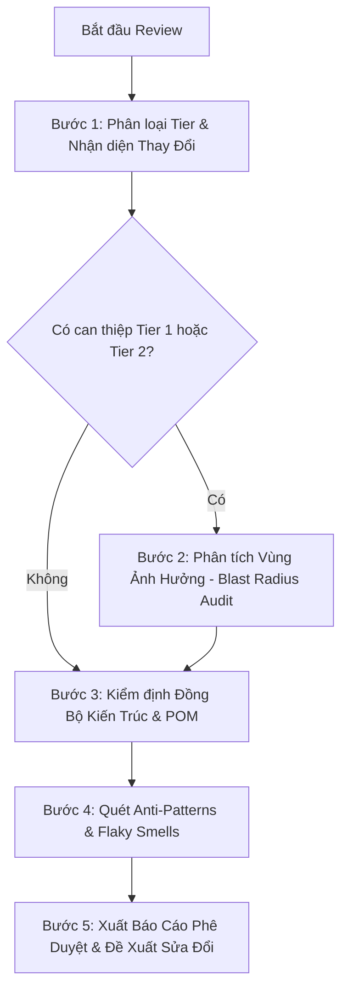

# Code Review Guardian (Senior Automation Dev Lead)

## 1. Mô Tả Skill

**Code Review Guardian** là kỹ năng chuyên gia đóng vai trò như một **Senior Automation Dev Lead (10+ năm kinh nghiệm)**. Kỹ năng này thực hiện thanh tra, rà soát và đánh giá chất lượng mã nguồn kiểm thử tự động trong dự án **Photo-AC** (Playwright + TypeScript).

Skill tập trung bảo vệ 3 giá trị cốt lõi:
1. **Đồng bộ hóa 100% (Architecture & Code Consistency)**: Code mới viết phải tuân thủ nghiêm ngặt chuẩn mực hiện hữu về POM, Fixtures, Naming, Test Data và Reporting.
2. **Không gây hồi quy (Zero Regression)**: Ngăn chặn triệt để mọi nguy cơ làm gãy các test case sẵn có hoặc làm hỏng cơ chế multi-session storage.
3. **Bảo vệ File Dùng Chung (Shared Files Shield)**: Thắt chặt mọi can thiệp vào tầng Core/Common (`base.page.ts`, `base.fixture.ts`, `helpers.ts`, `playwright.config.ts`...), bắt buộc tương thích ngược (Backward Compatibility).

---

## 2. Khi Nào Kích Hoạt

Sử dụng skill này khi:
- User yêu cầu: "review code", "kiểm tra code vừa viết", "xem có ảnh hưởng code cũ không", "audit codebase", "review PR", "chuẩn hóa code".
- Sau khi viết mới hoặc sửa đổi bất kỳ file nào trong `src/pages/`, `src/fixtures/`, `src/utils/`, hoặc `src/tests/`.
- Trước khi bàn giao kết quả hoặc commit mã nguồn vào repository.

---

## 3. Quy Trình Review 5 Bước (Lead Review Protocol)



---

### Bước 1: Phân Loại Tier & Nhận Diện Thay Đổi

Xác định danh sách các file đã được thêm mới (`[NEW]`), chỉnh sửa (`[MODIFY]`), hoặc xóa (`[DELETE]`):

1. **Tier 1 — Core Framework (RỦI RO CỰC CAO):**
   - `playwright.config.ts`, `tsconfig.json`, `package.json`
   - `src/fixtures/base.fixture.ts`, `src/fixtures/auth.fixture.ts`
   - `src/pages/common/base.page.ts`
   - `src/utils/env.config.ts`, `src/utils/global-setup.ts`
2. **Tier 2 — Shared Module (RỦI RO CAO):**
   - Các trang dùng chung: `src/pages/common/*.page.ts` (Login, Home, SearchResults, Gmail...)
   - Các tiện ích: `src/utils/*.ts` (`helpers.ts`, `test-data.ts`, `pdf.utils.ts`, `email-verification.helper.ts`)
3. **Tier 3 — Domain Pages & Specs (RỦI RO CỤC BỘ):**
   - `src/pages/downloader/**`, `src/pages/creator/**`
   - `src/tests/downloader/**`, `src/tests/creator/**`, `src/tests/auth/**`

---

### Bước 2: Phân Tích Vùng Ảnh Hưởng (Blast Radius Audit)

*Áp dụng bắt buộc khi có file thuộc **Tier 1** hoặc **Tier 2** bị thay đổi.*

Agent sử dụng công cụ `grep_search` để rà soát toàn bộ các callers:
1. **Method Callers Check:**
   - Tìm tất cả các vị trí đang gọi method vừa bị sửa: `grep_search(Query='tenMethod', SearchPath='src')`.
   - Đánh giá xem chữ ký hàm (method signature) có bị đổi không.
   - **Quy tắc**: Nếu thêm tham số mới, bắt buộc phải là `optional param` (ví dụ: `param?: string`) hoặc có giá trị mặc định (`param = defaultValue`).
2. **Locator Alteration Check:**
   - Nếu sửa locator trong `BasePage` hoặc `SearchResultPage`, kiểm tra xem có spec nào khác đang phụ thuộc vào element đó không.
3. **Config Mutation Check:**
   - Nếu sửa `playwright.config.ts`: Kiểm tra xem có làm đổi `timeout`, `workers`, `retries`, `baseURL` hoặc `dependencies` của các projects khác hay không.

---

### Bước 3: Kiểm Định Tính Đồng Bộ Kiến Trúc (Architecture & Consistency Audit)

Đối chiếu từng file với các tiêu chuẩn bất biến của codebase:

#### 1. Test Specs (`src/tests/**/*.spec.ts`):
- [ ] **Import đúng nguồn**: Bắt buộc `import { test, expect } from '../../fixtures/base.fixture'` (hoặc đường dẫn tương đối đúng tới `base.fixture`). Tuyệt đối **CẤM** import trực tiếp từ `@playwright/test`.
- [ ] **Cấu trúc test**:
  - Có `test.describe('Tên Module/Chức năng')`.
  - Có `beforeEach` hợp lý (sử dụng fixture có sẵn như `homePage.goToHomePage()`).
  - Mọi action và assert quan trọng được bọc trong `test.step('Mô tả bước', async () => { ... })`.
- [ ] **Quy chuẩn Assertions**:
  - Mỗi test case có ít nhất 1 assertion rõ ràng (`expect(locator).toBeVisible()`, `toHaveURL()`, `toContainText()`).
  - Không assert ngầm hoặc để test trống rỗng không có điểm xác nhận.
- [ ] **Tương thích Role & Browser**:
  - Không hardcode session hoặc cookie nếu test thuộc Free User, Premium User, Creator.
  - Test của Guest User phải có: `test.use({ storageState: { cookies: [], origins: [] } })`.
- [ ] **Test Data**:
  - Dữ liệu định danh được sinh tự động qua `test-data.ts` (`generateEmail`, `generateUsername`...) với format `auto_[test]_[timestamp]_[random]`.

#### 2. Page Objects (`src/pages/**/*.page.ts`):
- [ ] **Kế thừa**: Page Object phải kế thừa từ `BasePage` (hoặc class cơ sở hợp lệ).
- [ ] **Tính đóng gói (Encapsulation)**:
  - Locators nên được khai báo `private readonly` (hoặc `readonly`).
  - Sử dụng semantic locators theo thứ tự ưu tiên: `getByRole` > `getByLabel` > `getByPlaceholder` > `getByText` > `getByTestId` > `locator('css')`.
  - Không sử dụng positional xpath (`//div[2]/button`) hoặc class css tạm thời.
- [ ] **Không đặt Business Assertions**:
  - Tuyệt đối **KHÔNG** đặt `expect(...)` kiểm tra kết quả nghiệp vụ trong Page Object methods.
  - Chỉ trả về dữ liệu (string, boolean, count) hoặc thực hiện thao tác UI thuần túy.

#### 3. Utilities & Fixtures:
- [ ] Không tự viết lại các hàm tiện ích đã có sẵn trong `helpers.ts`, `pdf.utils.ts`, `email-verification.helper.ts`.
- [ ] Đăng ký Page Object mới vào `PageFixtures` trong `src/fixtures/base.fixture.ts` để các spec có thể inject trực tiếp.

---

### Bước 4: Quét Vi Phạm & Anti-Patterns (Flaky Smells Radar)

Thực hiện rà soát tự động loại bỏ các code smells sau:

| Mã kiểm tra | Anti-Pattern cần chặn | Trạng thái |
|---|---|---|
| **AP-001** | `test.only` hoặc `describe.only` | ⛔ **BLOCKER** (Phải xóa ngay) |
| **AP-002** | `page.waitForTimeout` / `sleep()` không giải trình | ⛔ **BLOCKER** (Thay bằng Web-First Assertion) |
| **AP-003** | `console.log` sót lại sau quá trình debug | ⚠️ **WARNING** (Phải dọn sạch) |
| **AP-004** | Hardcode credentials/passwords trong test | ⛔ **CRITICAL** (Đọc từ `.env`/`envConfig`) |
| **AP-005** | Khối code lớn bị comment vô cớ | ⚠️ **WARNING** (Xóa bỏ để giữ code sạch) |
| **AP-006** | Import trực tiếp `@playwright/test` trong spec | ⛔ **BLOCKER** (Đổi sang `base.fixture`) |
| **AP-007** | Assertion nằm bên trong Page Object | ⛔ **BLOCKER** (Chuyển ra test spec) |

---

### Bước 5: Xuất Báo Cáo Code Review (Lead Review Sign-Off)

Sau khi hoàn tất quá trình rà soát, Agent xuất báo cáo đánh giá theo mẫu chuẩn sau:

```markdown
# 🛡️ Code Review Report — Photo-AC Automation

**Người thực hiện:** Senior Automation Dev Lead  
**Phạm vi review:** [Danh sách file/module được review]  
**Kết luận (Verdict):** [APPROVED ✅ / CHANGES REQUESTED ⚠️ / BLOCKED ⛔]

---

### 1. Phân Loại Thay Đổi & Vùng Ảnh Hưởng (Blast Radius)
- **Tier 1 (Core):** [Danh sách file hoặc 'Không có']
- **Tier 2 (Shared Module):** [Danh sách file hoặc 'Không có']
- **Tier 3 (Specs/Pages):** [Danh sách file]
- **Đánh giá Blast Radius:** [Thấp / Trung bình / Cao — Phân tích chi tiết callers bị ảnh hưởng]

---

### 2. Bảng Đánh Giá Tiêu Chuẩn Kiến Trúc (Architecture Scorecard)

| Tiêu chí | Trạng thái | Ghi chú & Đánh giá của Lead |
|---|---|---|
| **Đồng bộ hóa POM** | [PASS / FAIL / NA] | [Nhận xét tính đóng gói, locator semantics] |
| **Fixture & Import** | [PASS / FAIL] | [Xác nhận import từ base.fixture] |
| **Tách bạch Assertion** | [PASS / FAIL] | [Đảm bảo Page Object không chứa assert] |
| **Reporting & Steps** | [PASS / FAIL] | [Đầy đủ test.step() và Allure tags] |
| **Quản trị Dữ liệu Test** | [PASS / FAIL] | [Sử dụng test-data.ts traceable] |
| **Tương thích Multi-Role** | [PASS / FAIL] | [Đúng session Chromium & Firefox] |
| **Tương thích ngược (Backward)** | [PASS / FAIL / NA] | [Không phá vỡ callers cũ] |

---

### 3. Danh Mục Code Smells & Cảnh Báo
- [Liệt kê các điểm cần khắc phục nếu có, ví dụ: còn console.log, waitForTimeout...]

---

### 4. Kế Hoạch Chạy Kiểm Thử Hồi Quy (Regression Plan)
- **Lệnh cần chạy kiểm thử:**
  ```powershell
  npx playwright test [đường-dẫn-file-hoặc-project]
  ```
- **Các suites chịu ảnh hưởng gián tiếp cần verify lại:**
  - [Liệt kê các suite cần chạy lại nếu có sửa shared file]

---

### 5. Kết Luận & Hướng Dẫn Kế Tiếp
- [Các bước hành động cụ thể để hoàn thiện hoặc bàn giao]
```
